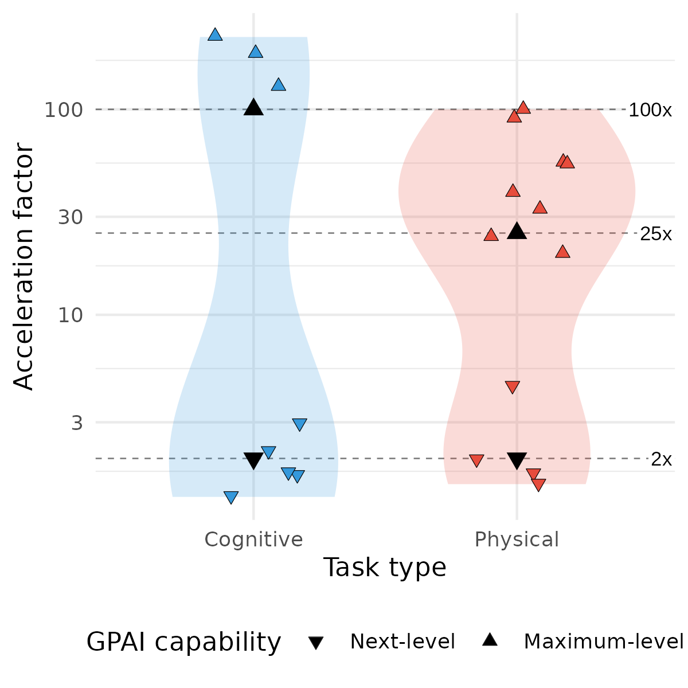
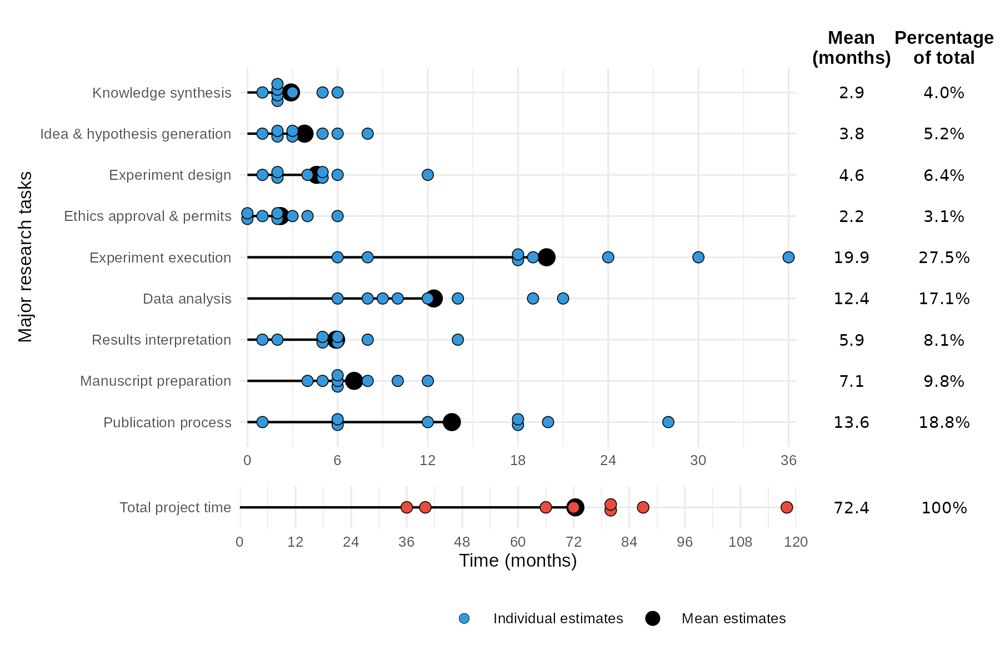
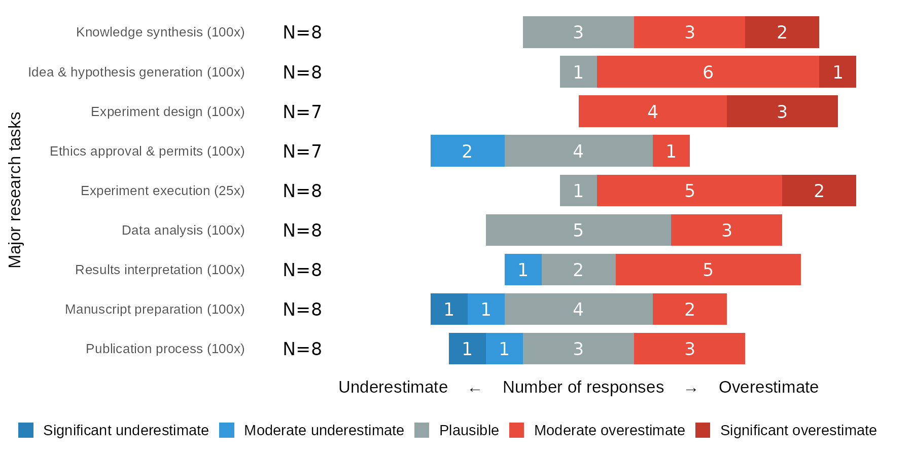

# What are the limits to biomedical research acceleration through general-purpose AI?
Hebenstreit, K.†, Convalexius, C.†, Reichl, S.†, Huber, S., Bock, C., & Samwald, M. (2025). What are the limits to biomedical research acceleration through general-purpose AI? *Scientific Reports* (in publication). · †Equal contribution · Preprint: [arXiv:2508.16613](https://doi.org/10.48550/arXiv.2508.16613)

---

General-purpose artificial intelligence (GPAI) is widely expected to transform scientific discovery, but in biomedicine its real-world impact remains uncertain. This study provides a systematic analysis of how much current biomedical research could realistically be accelerated by GPAI, and where fundamental limits remain.

<table border="0" cellspacing="0" cellpadding="0" style="border-collapse: collapse; border: 0;">
<tr>
<td width="50%" align="center" valign="bottom" style="border: 0;">

</td>
<td width="50%" align="center" valign="bottom" style="border: 0;">

</td>
</tr>
<tr>
<td align="left" valign="top" style="border: 0;">
 

<b>Research tasks</b>

We mapped the biomedical research lifecycle into <b>nine major tasks</b>:

<b>Cognitive</b> (blue): information processing, analysis, decision-making 
<b>Physical</b> (red): lab procedures, experiment execution

</td>
<td align="left" valign="top" style="border: 0;">
 

<b>Acceleration estimates</b>

Scoping review of 16 publications reveals a bimodal distribution:

<b>Next-level:</b> ~2x (current, partial automation) 
<b>Maximum-level:</b> ~100x cognitive, ~25x physical

</td>
</tr>
</table>

 

## Biological time constants

Large task-level speed-ups do not translate into equivalent reductions in overall project duration. Many biomedical projects are constrained by biological processes that cannot be compressed (cell growth, organism development, disease progression).

**Modeling a hypothetical 3-year project** with 3 months of incompressible biological processes:

| Project duration | Physical: No GPAI | Physical: Next-level (2x) | Physical: Max-level (25x) |
|---|:---:|:---:|:---:|
| **Cognitive: No GPAI** | 36 months | 32 months | 27 months |
| **Cognitive: Next-level (2x)** | 24 months | 20 months | 15 months |
| **Cognitive: Max-level (100x)** | 12 months | 7.7 months | **3.6 months** |

Even with maximum acceleration, the lower bound is **~3.6 months** (10x overall), with incompressible biological processes dominating.

 

## Expert elicitation

Eight senior biomedical researchers participated in an expert survey.

**How is time distributed across research tasks?**

<table border="0" cellspacing="0" cellpadding="0" style="border-collapse: collapse; border: 0;">
<tr>
<td align="center" valign="bottom" style="border: 0;">

</td>
</tr>
<tr>
<td align="left" valign="top" style="border: 0;">
 

<b>Project durations</b>

Experts reported average project durations of <b>~6 years</b> for high-impact publications.

</td>
</tr>
</table>

 

**Are maximum-level acceleration estimates plausible?**

<table border="0" cellspacing="0" cellpadding="0" style="border-collapse: collapse; border: 0;">
<tr>
<td align="center" valign="bottom" style="border: 0;">

</td>
</tr>
<tr>
<td align="left" valign="top" style="border: 0;">
 

<b>Acceleration plausibility</b>

Experts considered strong acceleration plausible for <b>manuscript preparation</b> and <b>publication processes</b>, but were skeptical about <b>hypothesis generation</b>, <b>experiment design</b>, and <b>execution</b>.

</td>
</tr>
</table>

 

**What limits acceleration potential?**

<table border="0" cellspacing="0" cellpadding="0" style="border-collapse: collapse; border: 0;">
<tr>
<td align="center" valign="bottom" style="border: 0;">

</td>
</tr>
<tr>
<td align="left" valign="top" style="border: 0;">
 

<b>Limiting factors</b>

All experts identified <b>scientific community assimilation</b> as a moderate to crucial bottleneck for realizing acceleration benefits.

</td>
</tr>
</table>

Realizing the full potential of GPAI-driven research acceleration will require coordinated investments in automation infrastructure, improved data accessibility, and reforms in research organization and publication practices.

 

## Code & data

This repository contains the data and R scripts used to generate the figures:

| Figure | Description | Data | Script |
|:---:|---|---|---|
| 1 | GPAI capability framework | — | [`plot_capability_model.R`](src/plot_capability_model.R) |
| 2 | Major research tasks | — | *(graphical software)* |
| 3 | Acceleration factors | [`acceleration_factors.csv`](data/Acceleration_Factors_with_Ranges_and_Midpoints_clean.csv) | [`plot_accelerations.R`](src/plot_accelerations.R) |
| 4 | Project time durations | [`project_times.csv`](data/anonymized_data_project_times.csv) | [`plot_project_times.R`](src/plot_project_times.R) |
| 5 | Plausibility estimates | [`plausibility.csv`](data/anonymized_data_plausibility_estimates.csv) | [`plot_plausibility_estimates.R`](src/plot_plausibility_estimates.R) |
| 6 | Limiting factors | [`limiting_factors.csv`](data/anonymized_data_limiting_factors.csv) | [`plot_limitation_estimates.R`](src/plot_limitation_estimates.R) |